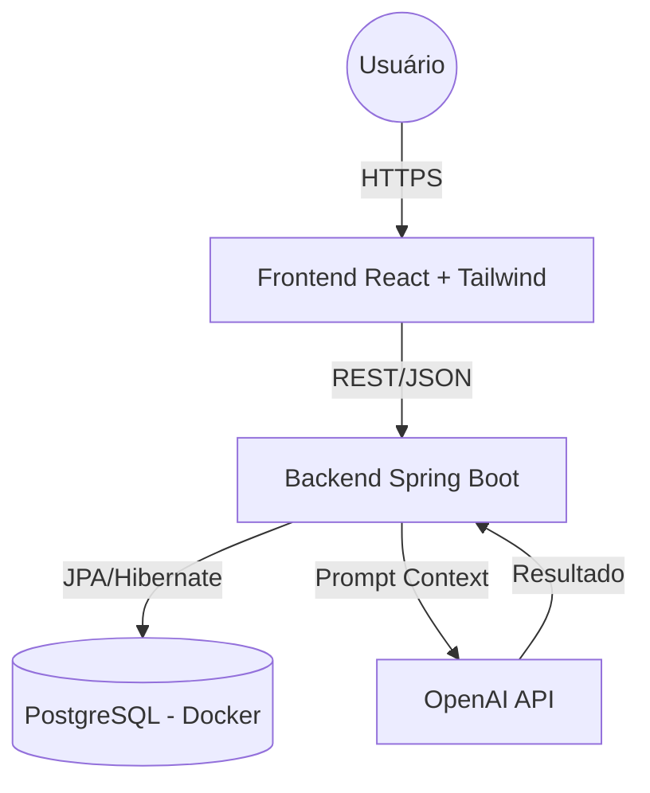

# 🏫✨ **EduSync — Sistema de Gestão Escolar Inteligente (ERP)**

### *Modernizando a educação com tecnologia, automação e IA.*

<p align="center">
  
  
  
  
  
  
</p>

---

## 🎯 **Visão Geral**

O **EduSync** integra toda a gestão escolar em uma única plataforma moderna, segura e intuitiva.
Desenvolvido com foco em escalabilidade, UX e produtividade, ele substitui processos manuais por automação e inteligência artificial.

> **Objetivo do sistema:** centralizar dados administrativos, pedagógicos e familiares em um só ecossistema digital — rápido, auditável e inteligente.

---

## ✨ **Destaques do Produto**

### 🧠 IA Pedagógica

Geração automática de pareceres descritivos com base em notas, faltas e perfil do aluno.

### 📄 Fábrica de Documentos Inteligentes

Boletins, declarações, carteirinhas e históricos gerados diretamente no navegador.

### 📱 Portal da Família & Aluno

Visão personalizada com notas, faltas, tarefas, ocorrências e documentos.

### 🔐 Segurança Avançada

RBAC completo com níveis de acesso: Coordenador, Secretaria, Professor, Aluno e Responsável.

---

# 🧩 **Módulos e Funcionalidades**

## **1. Administrativo – Secretaria & Coordenação**

* Matrículas e enturmação
* Emissão de documentos oficiais
* Configuração de ano letivo e bimestres
* Gestão de grade horária

---

## **2. Pedagógico – Professores**

* Diário de classe digital
* Lançamento de notas
* Postagem de tarefas (AVA)
* Mural de avisos

---

## **3. Portal do Aluno & Responsável**

* Dashboard completo
* Carteirinha digital com QR Code
* Acesso a documentos oficiais
* Lista de tarefas (Kanban)

---

# 🏗️ **Arquitetura — Visão Técnica**



---

# 🛠️ **Tecnologias**

### **Backend**

* Java 17
* Spring Boot 3
* Spring Security + JWT
* Spring Data JPA
* Lombok
* OpenAI API

### **Frontend**

* React (Vite)
* Tailwind CSS
* Context API
* Recharts
* Lucide Icons

### **Infra**

* Docker Compose
* PostgreSQL

---

# 🚀 **Rodando Localmente**

### ✔️ Pré-requisitos

* Java 17
* Node 18+
* Docker

### 🔸 **1. Subir Banco de Dados**

```bash
docker-compose up -d
```

### 🔸 **2. Backend**

* Configure a env `OPENAI_API_KEY` (opcional)
* Execute:

```
EduSyncApplication.java
```

### 🔸 **3. Frontend**

```bash
cd seop-web
npm install
npm run dev
```

📍 Acesse: **[http://localhost:5173](http://localhost:5173)**

---

# 🔑 **Usuários de Teste**

| Perfil      | Usuário     | Senha  | Acesso          |
| ----------- | ----------- | ------ | --------------- |
| Coordenação | coordenacao | 123456 | Total           |
| Secretaria  | secretaria  | 123456 | Matrículas/Docs |
| Professor   | prof        | 123456 | Notas/Chamada   |
| Responsável | pai         | 123456 | Apenas Filhos   |
| Aluno       | aluno       | 123456 | Notas/Tarefas   |
---

# 👩‍💻 **Sobre o Projeto**

Desenvolvido como solução completa de portfólio, aplicando princípios modernos de Engenharia de Software e Arquitetura Full Stack.

---
